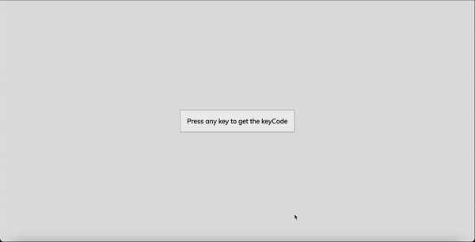

# Event_KeyCodes
A simple web application that displays the keycode of the pressed key.

## Preview

## Features

- Displays the keycode of the pressed key when a key is pressed.
- Highlights the pressed key on the virtual keyboard.
- Shows the corresponding key symbol and event details.

## Technologies Used

- HTML
- CSS
- JavaScript

## Usage

1. Clone the repository: `git clone https://github.com/Lincoln2303/Event_Keycodes.git`
2. Open the `index.html` file in a web browser.
3. Press any key on your keyboard to see the keycode, key symbol, and event details.

## Acknowledgements

The project is part of the "50 projects in 50 days - HTML, CSS & Javascript" course on Udemy by Brad Traversy.
